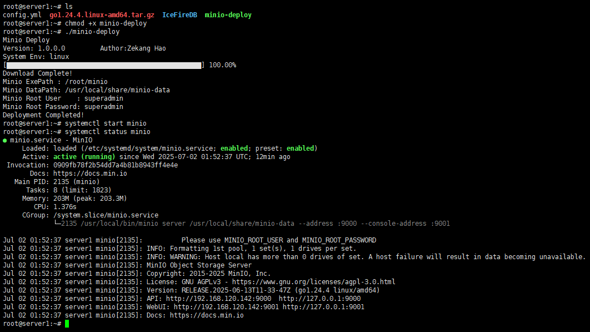
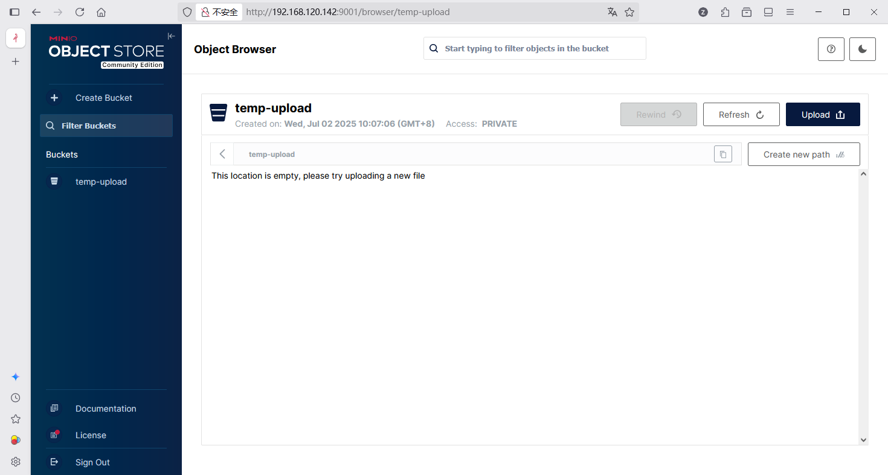
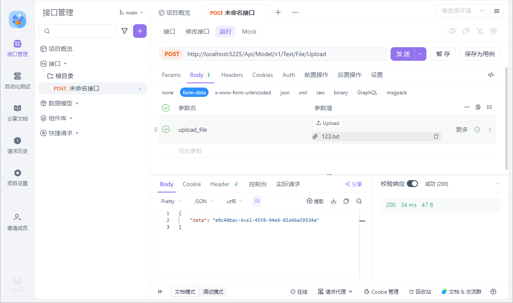
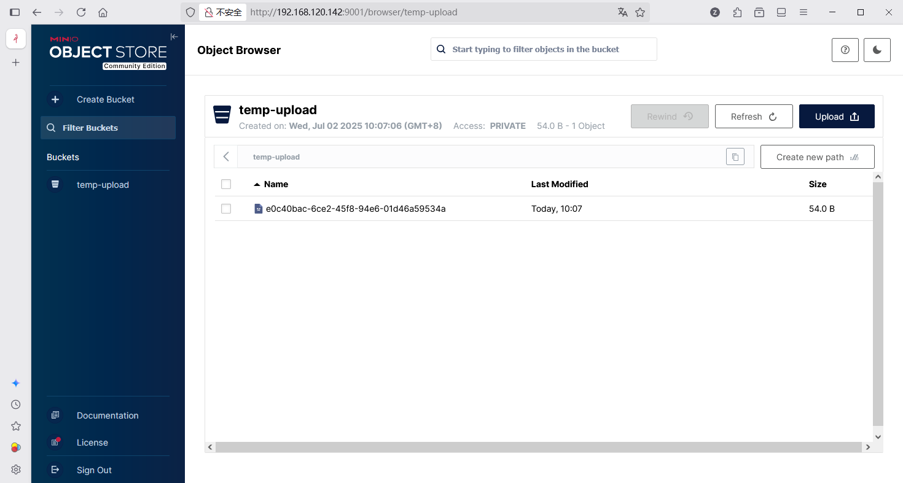

# minio-deploy

基于go语言实现的minio快速部署工具

# faq

1. 内网机器无法下载Minio怎么破？

如果内网机器，无法连接minio下载地址，把下载好的minio程序和部署程序放在一起，然后启动部署程序，也是会自动部署的，需要将minio程序命名为“minio”，windows下命名为“minio.exe”即可。

# config

```yaml
# 部署时创建使用的用户
systemUser: minio-user

# MinIO使用的数据目录，不存在则自动新建，注意位置和权限问题！
data: /usr/local/share/minio-data

# 启动时需要附带的参数
opts:

# 管理员账号
minioRootUser: superadmin

# 管理员密码
minioRootPassword: superadmin

# Web界面监听地址及端口
address: ':9000'

# API监听地址及端口
consoleAddress: ':9001'

# 区域数据，仅linux启用了
region: 'cn-north-1'
```

# Images

自动判断系统并下载最新的社区版本


自动根据配置文件信息对minio进行自动化部署



可正常访问minio界面



测试接口上传文件，返回文件guid



文件上传成功

